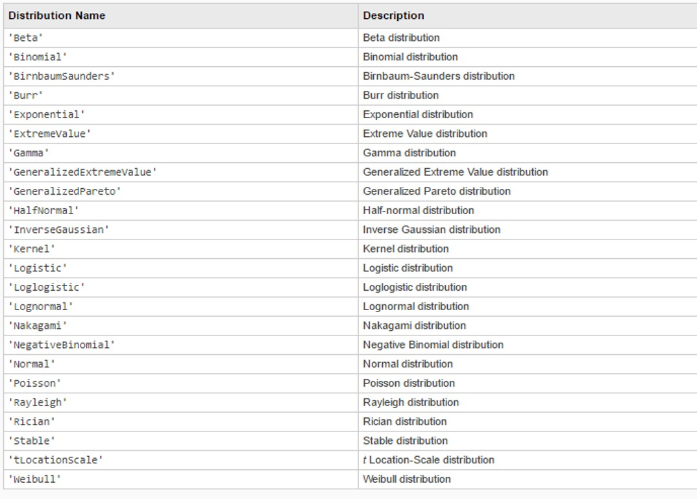

# Fitting the Data

We can make the observations from scatter plots & histograms more formal by looking at correlation values and pdf curves.

## Correlation
The function `corr(x,y)` gives the pairwise correlation coefficient between the column vectors `x` and `y` (they have to be columns).

``` Matlab
>> x = 1:10;
>> y = 10:-1:1;

>> corr(x',y')

ans =

    -1
```

The `corr` function can also be used to get a matrix of pairwise correlation coefficients of every column in a matrix. Let's create a matrix `X` with different linear functions in each column.

``` Matlab
% time
t = 0:0.01:1;
% Number of loops
Nloops = 4;
% initialize matrix
X = zeros(length(t),Nloops);
% loop through
for idx = 1:Nloops;
  % create a line with different slope
  X(:,idx) = idx .* t;      
end
% plot
plot(X)
```
And look at the correlation coefficients

``` Matlab
>> corr(X)

ans =

     1     1     1     1
     1     1     1     1
     1     1     1     1
     1     1     1     1
```

We can also get the p-values to see if the columns of X are significantly correlated (p < 0.05 for yes - maybe). DISCLAIMER this sort of test isn't suitable for all data. Consult your friendly neighbourhood statistician if you're not sure.

``` Matlab
>> [Corr,P] = corr(X)

P =

     1     0     0     0
     0     1     0     0
     0     0     1     0
     0     0     0     1
```

### *Challenge*
``` Matlab
% CHALLENGE
% What happens to the correlation coefficients
% if you add Gaussian noise
% to the lines in the matrix X?

% HINT: randn(m,n) will create a m-by-n matrix 
% of Gaussian noise with mean 0 and std 1. 
```

### *Challenge*

``` Matlab
% CHALLENGE
% What about non-linear data?
% Test the correlation with the function 

x = t .^ idx;

% Try using the rank correlation instead using
% corr(X,'type','Spearman')

% EXTENSION
% What about if you make the functions in X 
% sinusoidal instead of linear? 

% EXTENSION
% Check the correlation betweeen pedestrian counts at
% Bourke street from your previous code

```

## Clustering

The function `kmeans` is a good "quick and dirty" way to segment data into groups. 
We can make a toy example vector, `x` with two peaks in the histogram.
``` Matlab
% make a vector of random numbers with 
% half centred around -10 and half around 10.
x = [-10+5*randn(1,100), 10+5*randn(1,100)];

% use kmeans to find the clusters
idx = kmeans(x',2);
```
We can plot the data separately using the cluster index
```Matlab
plot(x(idx==1),'bo')
hold on;
plot(x(idx==2),'rx')
```
We can also get the centre point of each cluster
```Matlab
% a second output includes the centre points
[idx,C] = kmeans(x',2);

% we can plot a line through the middle using the 
% line function
line([0 100],[C(1) C(1)],'color','k')
line([0 100],[C(2) C(2)],'color','k')
```
### *Challenge*
``` Matlab
%% CHALLENGE 
% Look up kmeans in the help documentation and use 
% it to cluster the pedestrian
% counts at Flinders street at 8am (Flinders8)
% into two or more groups.

% HINT your input should be the pedestrian 
% counts from the previous challenge: 

Flinders8 = Count_Flinders(Hour_Flinders==8);

%% EXTENSION
% 1. Plot your two clusters as separate histograms
% 2. Include a vertical line on the graph marking the 
% center of the cluster (the function line() will help)
% 

%% EXTENSION
% Can you see any factors that are different between 
% the clusters? Check the day of the week. 

```

## Probability

We can fit the probability density function to our histograms using a kernel-density estimation (`ksdensity`), or we can check the fit of specific distribution shapes, such as Gaussian, exponential, etc (`fitdist`).

### *Challenge*
``` Matlab
% CHALLENGE
% Use fitdist to fit a normal distribution to 
% each of the clusters from the previous challenge
```

There are heaps of distributions included in the standard `fitdist` function, most of which I have never even heard of...



## Regression

The function `glmfit` standards for generalised linear model fit and can be used for linear regression and log regression as well as a few more (binomial etc)
