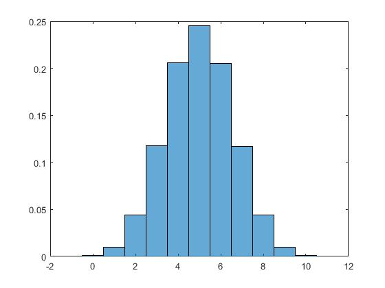
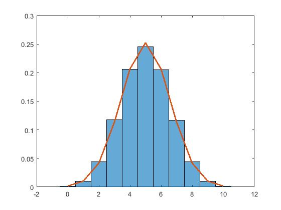
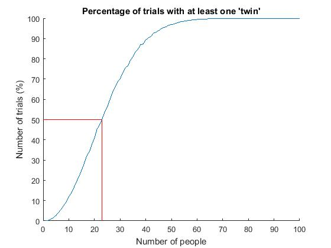

# Randomness & Simulation

The command `rand`, `randn`, and `randi` can be used to generate random numbers (uniform, normally distributed, or integers respectively), which is useful for Monte Carlo simulations and other kinds of hypothesis testing.

To generate random numbers from a uniform distribution between [a b] we can use
``` Matlab
a = 0;
b = 1;
a + (b - a) * rand

ans =

    0.9058
```
And from a normal distribution with mean (mu) of 0 and standard deviation (sigma) of 1

``` Matlab
mu = 0;
sigma = 1;
randn(mu,sigma)

ans =

   -2.2588
```

To generate random integers on the range [a b] we can use
``` Matlab
a = -10;
b = 10;
randi([a b])

ans =

     9
```
### *Challenge*
```Matlab
%% CHALLENGE
% Work out how to use the rand, randn and randi commands
% to generate a random matrix instead of a
% single numbers


%% EXTENSION
% Write a function that simulates the output of a dice being
% rolled. If you want, give your function an input Nd, 
% which indicates how many die to roll.
% e.g.

dice(5)

ans =

     1     4     6     1     2
```

Using random numbers in a loop is a major part of running simulations. For example let's say there is a panel of 10 scientists at a conference, and two of them are women. How likely is it that that the outcome would happen by chance?

We can simulate one million random panels to check.
``` Matlab
% 1 million trials
Ntrials = 1e6;
% intialize count of women in the panel
Nwomen = zeros(1,Ntrials);

for n = 1:Ntrials
    
    % generate a random panel
    panel = rand(1,10);
    % let the probability a member is a woman be 50%
    Nwomen(n) = sum(panel > 0.5);
    
end

% plot the result
histogram(Nwomen,-0.5:10.5,'normalization','pdf')
```


The probability that the panel has less than three women is 5.5%

```Matlab
100 * sum(Nwomen <= 2) / Ntrials

ans =

    5.4748
```

I guess the organizers of that panel are safe in the knowledge that significance is tested at LESS than 5%. They're still on shaky ground if you ask me.

What if we approximate the above histogram as a Gaussian? 

``` Matlab
% plot the result
histogram(Nwomen,-0.5:10.5,'normalization','pdf')
hold on;
% plot a Gaussian pdf over values from 0 to 10, 
% with the same mean and variance as our binomial
plot(0:10,normpdf(0:10,mean(Nwomen),std(Nwomen)),'linewidth',2)
```


### *Challenge*
Use `normcdf` to work out the probability of being less than or equal to two women.

Because we are working with a binomial distribution with $$n=10$$  (number on the panel) and $$p = 0.5$$  (chance of a woman being chosen) we can approximate a normal distribution with mean, $$\mu = np$$ and variance, $$\sigma = np(1-p)$$

NB: Gaussians are continuous and binomial values are discrete. One way to make the conversion and calculate the probability that the number of women is less than or equal to 2, is to use the value 2.5. (If you wanted to know the probability of there being strictly less than 2 women, you would use 1.5).
``` Matlab
%% CHALLENGE

% mu

% sigma

% calculate the Gaussian cumulative distribution for 2.5
```


### *Challenge*
The birthday party problem:

How many people do you need to have in a room for there to be a more than 50% chance that two of them will have the same birth date? (Assume every birth date is equally likely).

``` Matlab
% CHALLENGE
% Use a simulation to numerically estimate the answer
% to the birthday party problem

% HINT: The function unique() will tell you how many unique
% numbers are in a vector. In this case, your vector may contain
% randomly assigned birth dates.
```

There are lots of ways this could be done, so think about what your code should do before you write it. 

SPOILER ALERT: for a hint (and the answer to the birthday party problem), keep reading

---


I ran a simulation with two loops to check different sized groups of people with randomly assigned birthdays:

``` Matlab
Nppl = 100;
Ntrials = 10000;

for person_idx = 1:1Nppl
  for trial_idx = 1:Ntrials
  
  end
end
```

