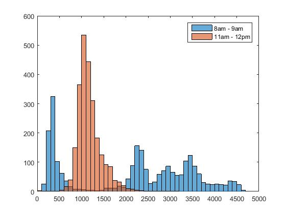

# Visualizing the Data

**Open data is everywhere!**

Go to [https://data.melbourne.vic.gov.au/](https://data.melbourne.vic.gov.au/) and see how many data sources they have data on all aspects of Melbourne life! (seriously - look no further if you need to know the locations of all the public toilets, or the gradient of every footpath...)

**Example: data of pedestrian numbers in the CBD**

In this example we'll look at the dataset called 'Pedestrian Counts', which contains an hourly count for the number of people that passed a particular sensor in Melbourne. That's data every hour, on the hour at 18 locations, since 2009! And MATLAB didn't even bat an eyelid when I tried to load it up. (Ok, yes it did warn me I was opening a large text file, but it still worked).

** Sensor Locations**
1. Bourke Street Mall (North)
2. Bourke Street Mall (South)
3. NA
4. Town Hall (West)
5. Princes Bridge 
6. Flinders Street Station Underpass
7. NA
8. NA
9. Southern Cross Station
10. Victoria Point
11. Waterfront City
12. New Quay
13. Flagstaff Station
14. Sandridge Bridge
15. State Library
16. Australia on Collins
17. Collins Place (South)
18. Collins Place (North)

Two tools that are used again and again when exploring data are scatter plots (`scatter`) and histograms (`hist` and `histc`). *NB both of these plots can also be achieved using the `plot` function*


## Scatter plots
The scatter plot command `scatter(x,y)` creates a scatter plot of the data points in the vectors x and y.

```Matlab
x = 0:10;
y = 10:-1:0;
scatter(x,y)
```

Let's use scatter to see if there is any correlation between North and South Bourke Street.

```Matlab

% First get the dates of both locations by indexing
% on their Sensor_ID value
Dates_BourkeN = Date_Time(Sensor_ID == 1);
Dates_BourkeS = Date_Time(Sensor_ID == 2);

% Similarly, we can use indexing to separate out the 
% count data for these specific locations
BourkeN = Hourly_Counts(Sensor_ID == 1);
BourkeS = Hourly_Counts(Sensor_ID == 2);

% We need to find out which dates we have that are 
% the same for both locations
same_ind_South = ismember(Dates_BourkeS,Dates_BourkeN);
same_ind_North = ismember(Dates_BourkeN,Dates_BourkeS);

% We only want to compare the count data from the dates
% that are the same for both locations
BourkeS = BourkeS(same_ind_South);
BourkeN = BourkeN(same_ind_North);

% We can check for correlation by looking at the scatter plot
scatter(BourkeN,BourkeS)
```
MATLAB gives you a default scatter plot that looks something like this (we can pretty it up later, but for now we can clearly see that there is a relationship between North and South Bourke Street).

###*Challenge One*
```Matlab
% CHALLENGE
% Create a scatter plot of two new locations

% EXTENSION TASKS
% Customize your plot - give it axis labels and 
% change the colors

```

## Histograms
The `histogram(data,bins)` plots a histogram of all the data points between the values of bins (i.e. `bins = 0:10:100` will create a histogram that goes from 0 to 100 with bins of width 10). 

```Matlab
data = randi(100,1,100);
histogram(data,0:10:100);
```

We're going to plot the distribution of foot traffic at Flinders Street station at different times of day.
Flinders Street station is sensor number 6.

```Matlab
% Date/time of measurements at flinders street station
Dates_Flinders = Date_Time(Sensor_ID == 6);

% Hourly counts at flinders street station
Count_Flinders = Hourly_Counts(Sensor_ID == 6);
```
we can use `datevec` to convert the dates to vectors

```Matlab
Dates_Flinders(1)

ans = 

   01-May-2009

datevec(Dates_Flinders(1))

ans =

        2009           5           1           0           0           0

```
We can convert all the dates and only select the hours want
```Matlab
% get the dates as a vector
Dates_Flinders = datevec(Dates_Flinders);

% The format is year-mon-day-hour-min-second
Hour_Flinders = Dates_Flinders(:,4);
Hour_SC = Dates_SC(:,4);
```
Let's look at the difference between 8am and 11am. We can pull out every measurement that was taken at 8am by indexing using our hour values in `Hour_Flinders`. 
```Matlab
% Look at 8am vs 11am for Flinders St
Flinders8 = Count_Flinders(Hour_Flinders==8);
Flinders11 = Count_Flinders(Hour_Flinders==11);
```
We can display the two distributions as histograms using MATLABs default `hist` command
```Matlab
figure;
% plot the first distribution
histogram(Flinders8,0:100:max(Flinders8));
% leave the plot in position
hold on
% plot the second distribution
histogram(Flinders11,0:100:max(Flinders11));
% create a legend
legend({'8am - 9am','11am - 12pm'})
```

Note that using the `hold on` command automatically assigns two different colors to the plots. 

You can plot the probability density instead of counts on the y-axis using the option:
```Matlab
histogram(Flinders11,0:100:max(Flinders11),'Normalization','pdf')
```

###*Challenge Two*
```Matlab
% CHALLENGE
% Plot histograms of two different times for at
% another location

% EXTENSION TASKS
% Plot histograms for 8am on Monday at Flinders Street
% and 8am on Sunday at Flinders Street
% HINT: The function 'weekday' will help a lot!

% Plot a scatter plot between 8am and 5pm
% at Flinders Street station to see if 
% there is any correlation

% Think of another question you're interested in 
% learning about from this data and make a plot!
```

###*Challenge Three*

```Matlab
%% CHALLENGE
% Try download some other data you are interested in
% read it in and visualize some aspect. 
% You can use the user interface to try a few plots out, 
% but once you are happy with your plot write it in a
% script!
```

