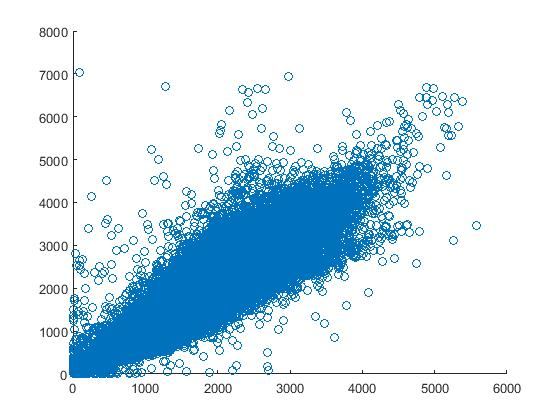

# Visualizing the Data

**Open data is everywhere!**

Go to [https://data.melbourne.vic.gov.au/](https://data.melbourne.vic.gov.au/) and see how many data sources they have data on all aspects of Melbourne life! (seriously - look no further if you need to know the locations of all the public toilets, or the gradient of every footpath...)

**Example: data of pedestrian numbers in the CBD**

In this example we'll look at the dataset called 'Pedestrian Counts', which contains an hourly count for the number of people that passed a particular sensor in Melbourne. That's data every hour, on the hour at 18 locations, since 2009! And MATLAB didn't even bat an eyelid when I tried to load it up. (Ok, yes it did warn me I was opening a large text file, but it still worked).

** Sensor Locations**
1. Bourke Street Mall (North)
2. Bourke Street Mall (South)
3. NA
4. Town Hall (West)
5. Princes Bridge 
6. Flinders Street Station Underpass
7. NA
8. NA
9. Southern Cross Station
10. Victoria Point
11. Waterfront City
12. New Quay
13. Flagstaff Station
14. Sandridge Bridge
15. State Library
16. Australia on Collins
17. Collins Place (South)
18. Collins Place (North)

Two tools that are used again and again when exploring data are scatter plots (`scatter`) and histograms (`hist` and `histc`). *NB both of these plots can also be achieved using the `plot` function*


## Scatter plots
Let's see if there is any correlation between North and South Bourke Street.

```Matlab

% First get the dates of both locations by indexing
% on their Sensor_ID value
Dates_BourkeN = Date_Time(Sensor_ID == 1);
Dates_BourkeS = Date_Time(Sensor_ID == 2);

% Similarly, we can use indexing to separate out the 
% count data for these specific locations
BourkeN = Hourly_Counts(Sensor_ID == 1);
BourkeS = Hourly_Counts(Sensor_ID == 2);

% We need to find out which dates we have that are 
% the same for both locations
same_ind_South = ismember(Dates_BourkeS,Dates_BourkeN);
same_ind_North = ismember(Dates_BourkeN,Dates_BourkeS);

% We only want to compare the count data from the dates
% that are the same for both locations
BourkeS = BourkeS(same_ind_South);
BourkeN = BourkeN(same_ind_North);

% We can check for correlation by looking at the scatter plot
scatter(BourkeN,BourkeS)
```
MATLAB gives you a default scatter plot that looks something like this (we can pretty it up later, but for now we can clearly see that there is a relationship between North and South Bourke Street).

###*Challenge One*

## Histograms

###*Challenge Two*

